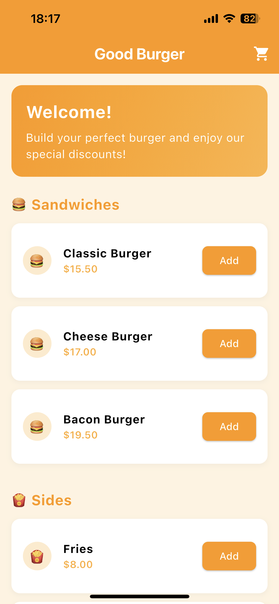
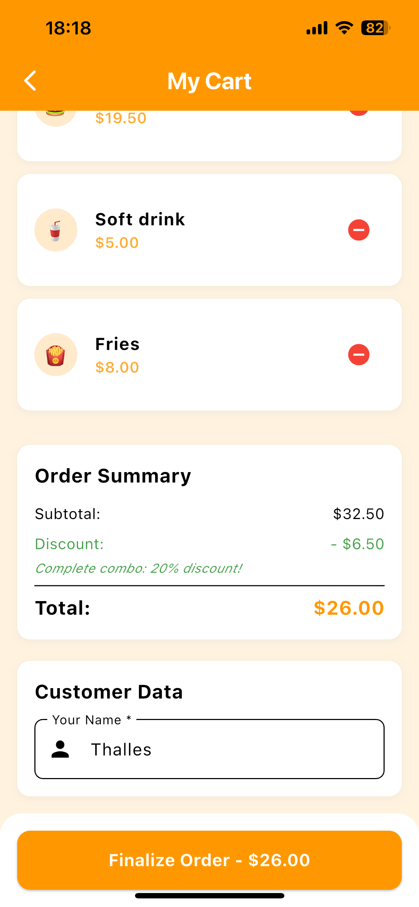
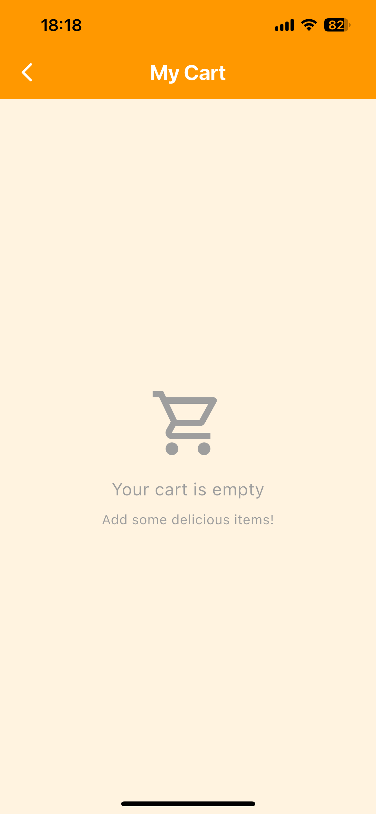
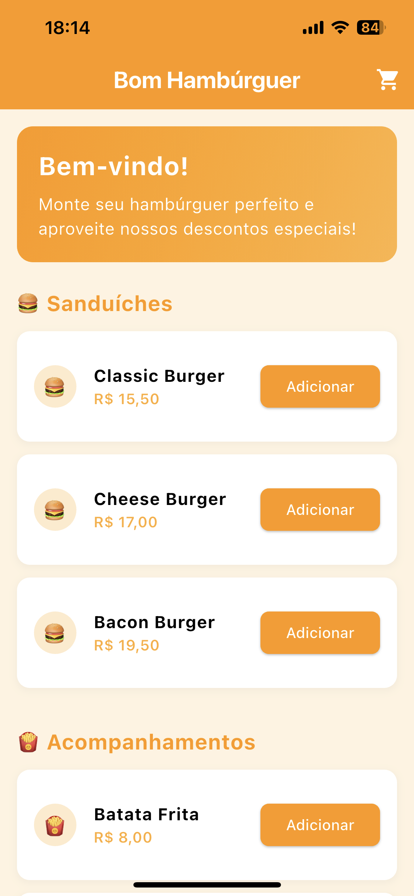

# 🍔 Bom Hambúrguer

*[Português](#português) | [English](#english)*

---

## English

### 📱 About

**Bom Hambúrguer** is a modern Flutter mobile application for hamburger ordering. The app provides an intuitive interface for browsing products, managing cart items, and completing orders with a clean and responsive design.

### ✨ Features

- **Product Catalog**: Browse through different types of hamburgers and food items
- **Shopping Cart**: Add, remove, and manage items in your cart
- **Order Management**: Complete checkout process with order summary
- **Internationalization**: Full support for English and Portuguese (Brazil)
- **Local Database**: SQLite integration for data persistence
- **Responsive Design**: Optimized for different screen sizes
- **Clean Architecture**: MVVM pattern with dependency injection

### 📱 App Preview

<p align="center">
  
  
  
</p>

**Features shown:**
- 🏠 **Home Screen**: Welcome message, hamburger menu, sides section, and special promotions
- 🛒 **Cart Management**: Add/remove items, automatic discount calculation (20% combo discount)
- ✅ **Order Confirmation**: Instant confirmation with total amount and applied discounts

### 🛠️ Technologies Used

- **Framework**: Flutter 3.4.3+
- **State Management**: Provider
- **Navigation**: GoRouter
- **Database**: SQLite (sqflite)
- **Dependency Injection**: GetIt
- **Architecture**: MVVM (Model-View-ViewModel)
- **Internationalization**: Flutter Intl
- **Functional Programming**: Dartz

### 🚀 Getting Started

#### Prerequisites

- Flutter SDK (3.4.3 or higher)
- Dart SDK
- Android Studio / VS Code
- Android SDK / Xcode (for iOS)

#### Installation

1. **Clone the repository**
   ```bash
   git clone https://github.com/yourusername/bom_hamburguer.git
   cd bom_hamburguer
   ```

2. **Install dependencies**
   ```bash
   flutter pub get
   ```

3. **Generate localization files**
   ```bash
   flutter gen-l10n
   ```

4. **Run the application**
   ```bash
   flutter run
   ```

### 📱 Supported Platforms

- ✅ Android
- ✅ iOS
- ⚠️ Web (not optimized)
- ⚠️ Desktop (not optimized)

### 🏗️ Project Structure

```
lib/
├── injector.dart           # Dependency injection setup
├── main.dart              # Application entry point
├── l10n/                  # Internationalization files
├── models/                # Data models
│   ├── cart_item.dart
│   └── product.dart
├── repositories/          # Data layer
│   └── product_repository.dart
├── services/              # Business logic services
│   ├── cart_service.dart
│   └── database_service.dart
├── viewmodels/            # View models (MVVM)
│   ├── checkout_viewmodel.dart
│   └── home_screen_viewmodel.dart
└── views/                 # UI screens and widgets
    ├── checkout_screen.dart
    ├── home_screen.dart
    └── widgets/
```

### 🧪 Testing

Run tests using:

```bash
flutter test
```

## Português

### 📱 Sobre

**Bom Hambúrguer** é um aplicativo móvel moderno desenvolvido em Flutter para pedidos de hambúrgueres. O app oferece uma interface intuitiva para navegar pelos produtos, gerenciar itens do carrinho e finalizar pedidos com um design limpo e responsivo.

### ✨ Funcionalidades

- **Catálogo de Produtos**: Navegue por diferentes tipos de hambúrgueres e comidas
- **Carrinho de Compras**: Adicione, remova e gerencie itens no seu carrinho
- **Gestão de Pedidos**: Processo completo de checkout com resumo do pedido
- **Internacionalização**: Suporte completo para Inglês e Português (Brasil)
- **Banco de Dados Local**: Integração SQLite para persistência de dados
- **Design Responsivo**: Otimizado para diferentes tamanhos de tela
- **Arquitetura Limpa**: Padrão MVVM com injeção de dependência

### 📱 Prévia do App

<p align="center">
  
  
  
</p>

**Funcionalidades mostradas:**
- 🏠 **Tela Inicial**: Mensagem de boas-vindas, menu de hambúrgueres, acompanhamentos e promoções especiais
- 🛒 **Gestão do Carrinho**: Adicionar/remover itens, cálculo automático de desconto (20% desconto combo)
- ✅ **Confirmação do Pedido**: Confirmação instantânea com valor total e descontos aplicados

### 🛠️ Tecnologias Utilizadas

- **Framework**: Flutter 3.4.3+
- **Gerenciamento de Estado**: Provider
- **Navegação**: GoRouter
- **Banco de Dados**: SQLite (sqflite)
- **Injeção de Dependência**: GetIt
- **Arquitetura**: MVVM (Model-View-ViewModel)
- **Internacionalização**: Flutter Intl
- **Programação Funcional**: Dartz

### 🚀 Como Começar

#### Pré-requisitos

- Flutter SDK (3.4.3 ou superior)
- Dart SDK
- Android Studio / VS Code
- Android SDK / Xcode (para iOS)

#### Instalação

1. **Clone o repositório**
   ```bash
   git clone https://github.com/yourusername/bom_hamburguer.git
   cd bom_hamburguer
   ```

2. **Instale as dependências**
   ```bash
   flutter pub get
   ```

3. **Gere os arquivos de localização**
   ```bash
   flutter gen-l10n
   ```

4. **Execute a aplicação**
   ```bash
   flutter run
   ```

### 📱 Plataformas Suportadas

- ✅ Android
- ✅ iOS
- ⚠️ Web (não otimizado)
- ⚠️ Desktop (não otimizado)

### 🏗️ Estrutura do Projeto

```
lib/
├── injector.dart           # Configuração de injeção de dependência
├── main.dart              # Ponto de entrada da aplicação
├── l10n/                  # Arquivos de internacionalização
├── models/                # Modelos de dados
│   ├── cart_item.dart
│   └── product.dart
├── repositories/          # Camada de dados
│   └── product_repository.dart
├── services/              # Serviços de lógica de negócio
│   ├── cart_service.dart
│   └── database_service.dart
├── viewmodels/            # View models (MVVM)
│   ├── checkout_viewmodel.dart
│   └── home_screen_viewmodel.dart
└── views/                 # Telas e widgets de UI
    ├── checkout_screen.dart
    ├── home_screen.dart
    └── widgets/
```

### 🧪 Testes

Execute os testes usando:

```bash
flutter test
```
